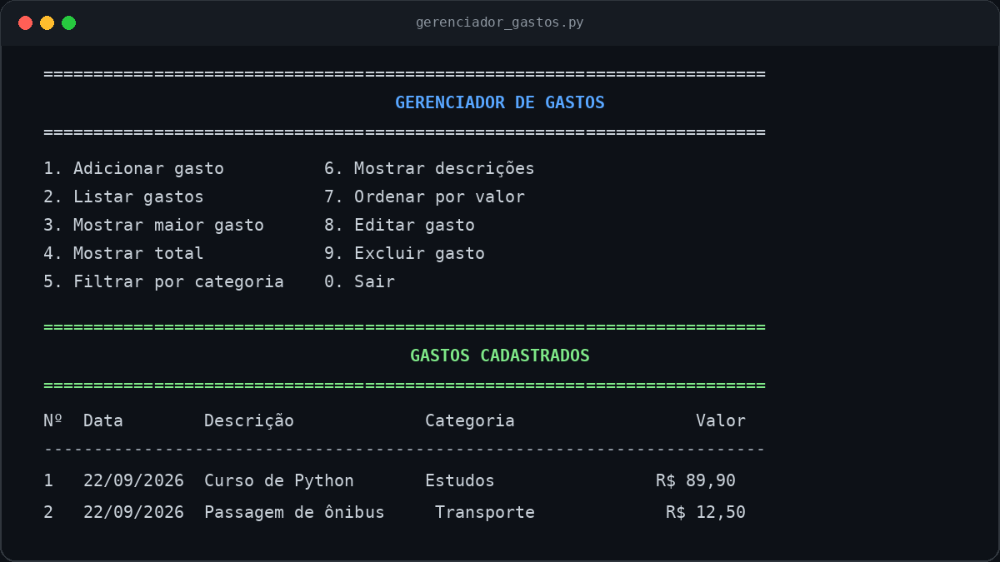

# Gerenciador de gastos em Python

Projeto de terminal desenvolvido para praticar os fundamentos de Python por
meio de um problema real: registrar e consultar gastos pessoais.

O repositório preserva a primeira versão do desafio e apresenta uma versão
refatorada. Assim, é possível comparar o código e acompanhar minha evolução
durante o **Curso de Python 3**, de Otávio Miranda, na Udemy.



## Funcionalidades

- adicionar gastos com descrição, valor, categoria e data;
- listar os registros em uma tabela organizada;
- editar e excluir gastos;
- mostrar o maior gasto e o total acumulado;
- filtrar os registros por categoria;
- exibir somente as descrições;
- ordenar os gastos do maior para o menor valor;
- apresentar valores no formato brasileiro, como `R$ 1.250,90`;
- validar opções, números positivos, categorias e datas.

> Os dados ficam na memória enquanto o programa está aberto. O salvamento em
> arquivo poderá ser implementado em uma próxima versão.

## Como executar

É necessário ter o Python 3 instalado. O projeto não utiliza bibliotecas
externas.

```bash
git clone https://github.com/LuKeT-Dev-Py/gerenciador-de-gastos-python.git
cd gerenciador-de-gastos-python
python gerenciador_gastos.py
```

No Windows, caso o comando `python` não funcione, tente:

```bash
py gerenciador_gastos.py
```

## Estrutura

```text
gerenciador-de-gastos-python/
├── docs/
│   ├── demonstracao.svg
│   └── demonstracao.png
├── .gitignore
├── gerenciador_gastos.py
├── LICENSE
├── README.md
└── versao_original.py
```

- `versao_original.py`: primeira solução, mantida para comparação;
- `gerenciador_gastos.py`: versão refatorada e recomendada para execução;
- `docs/demonstracao.png`: captura de demonstração pronta para divulgação;
- `docs/demonstracao.svg`: versão vetorial da demonstração.

## Principais alterações

| Antes | Depois | Motivo |
|---|---|---|
| Todo o programa dentro de um único `while` | Responsabilidades divididas em funções | Facilita a leitura, os testes e futuras alterações |
| Chaves como `Gasto` e variável `dicta` | Nomes padronizados, como `descricao` e `gasto` | Torna a intenção do código mais clara |
| Categorias digitadas por extenso | Categorias apresentadas em um menu numérico | Evita erros de digitação |
| Gastos exibidos como dicionários | Tabela com colunas alinhadas | Melhora a experiência no terminal |
| Sem registro de data | Data validada no formato `DD/MM/AAAA` | Acrescenta contexto aos registros |
| Registros imutáveis | Opções para editar e excluir | Permite corrigir e administrar os dados |
| Valores como números comuns | Formatação brasileira (`R$ 25,90`) | Facilita a interpretação |
| `except` genérico | Exceções específicas, como `ValueError` | Evita esconder erros inesperados |
| Execução imediata ao importar | Proteção com `if __name__ == '__main__'` | Permite importar as funções sem iniciar o menu |

## Conceitos praticados

- listas, tuplas e dicionários;
- funções e retorno de valores;
- laços `while` e `for`;
- condicionais;
- tratamento de exceções;
- compreensão de listas;
- `lambda`, `max`, `sum` e `sorted`;
- importação do módulo `datetime`;
- validação e formatação de dados;
- organização de um programa em responsabilidades menores.

## Aprendizados novos

### Validação de datas com `datetime`

`datetime.strptime(texto, '%d/%m/%Y')` tenta interpretar o texto de acordo com
o formato informado. Datas inexistentes, como `31/02/2026`, geram
`ValueError`; o programa captura esse erro e solicita outra data.

### Bloco `if __name__ == '__main__'`

O bloco executa `main()` somente quando o arquivo é iniciado diretamente. Se o
arquivo for importado por outro programa, suas funções ficam disponíveis sem
abrir o menu automaticamente.

### Funções com responsabilidade única

Cada função cuida de uma tarefa, como ler um valor, formatar moeda ou editar um
registro. Essa separação reduz repetições e deixa o fluxo principal mais fácil
de entender.

## Possíveis próximas versões

- salvar os gastos em JSON ou em um banco de dados;
- criar testes automatizados;
- gerar relatórios mensais;
- adicionar uma interface gráfica ou web.

## Licença

Distribuído sob a licença MIT. Consulte o arquivo [LICENSE](LICENSE).
